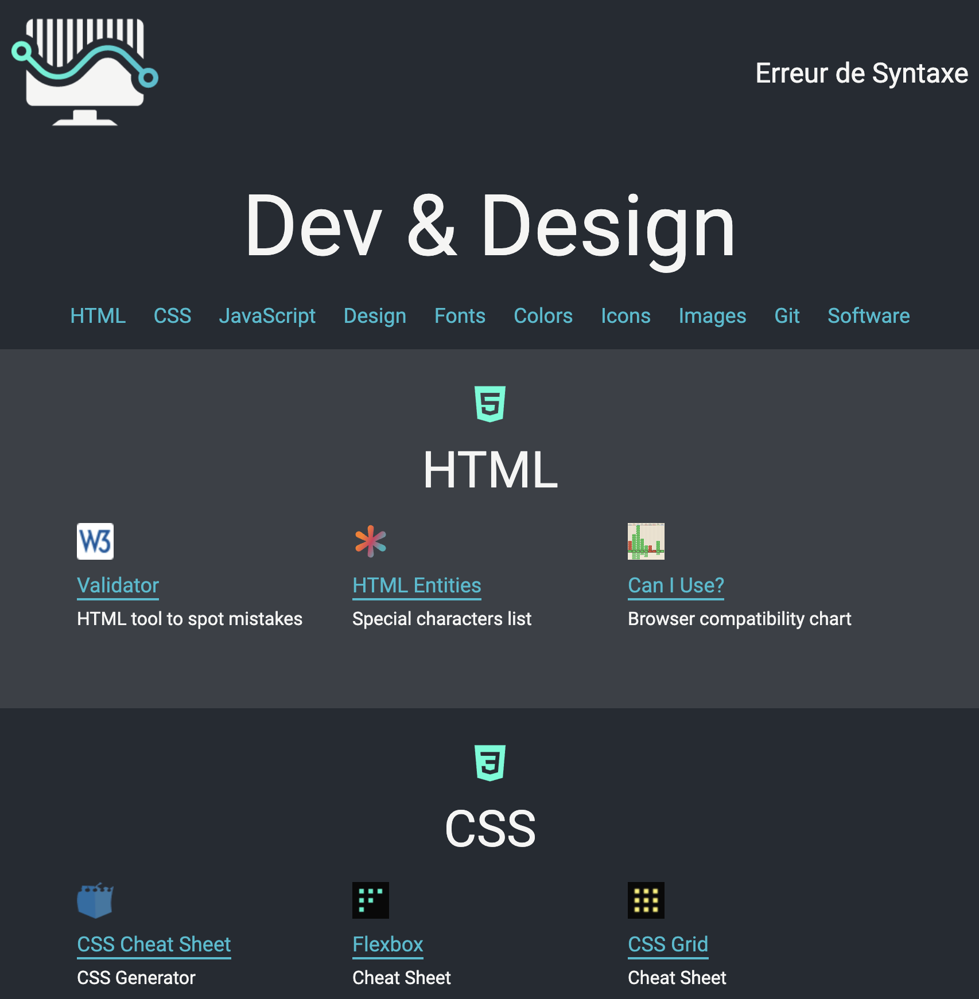

# Web Dev Resources

A reference page with resources used in the design and development of web pages.

## About the Project

<!-- ### Preview

    

### Live

<a href='http://google.com/'>Google</a> -->

### Objective

The goal of the project is to collect useful resources and present them in a
useful way.

### Features

- Web development resources
- Web design resources
<!-- - Add something
- Edit something
- Remove something
- Allow users to complicate dev's job -->

## Built With

<!--  -->

## To-Do

- [x] Understand Objectives
- [x] Write Plan
- [x] List Themes & Resources
- [ ] Build Markup
  - [x] HTML
    - [x] html entities (https://css-tricks.com/snippets/html/glyphs/)
    - [x] html validator (https://validator.w3.org/#validate_by_input)
  - [x] JS
    - [x] DOM basics (https://www.javascripttutorial.net/javascript-dom/)
    - [x] DOM manipulation (https://youmightnotneedjquery.com/)
    - [x] Airbnb JavaScript Guide (https://github.com/airbnb/javascript)
    - [x] Idiomatic JavaScript (https://github.com/rwaldron/idiomatic.js)
    - [x] Array Methods (img)
    - [x] Array Methods Cheat Sheet (https://dev.to/devsmitra/28-javascript-array-hacks-a-cheat-sheet-for-developer-5769)
    - [x] Webpack (https://webpack.js.org/guides/getting-started/)
    - [x] Building a House (https://www.ayweb.dev/blog/building-a-house-from-the-inside-out)
    - [x] Zahra (https://github.com/zahrabateninia)
  - [x] CSS
    - [x] CSS Cheat Sheet (https://htmlcheatsheet.com/css/)
    - [x] Flexbox Most Common (https://flexbox.malven.co/)
    - [x] Grid Most Common (https://grid.malven.co/)
    - [x] CSS Tricks (https://css-tricks.com/)
    - [x] CSS Layout (https://learnlayout.com/)
    - [x] Selector Practice (https://flukeout.github.io/)
    - [x] Flexbox Practice (https://flexboxfroggy.com/)
    - [x] Grid Practice (https://cssgridgarden.com/)
  - [x] Git
    - [x] Learn Git Branching (https://learngitbranching.js.org/)
  - [ ] Design
    - [ ] Design Aspects (img)
    - [ ] Website Personalities (img)
    - [ ] Font Rules (img)
    - [ ] Colors Meaning (img)
    - [ ] Colors Rules (img)
    - [ ] Images Rules (img)
    - [ ] Icons (img)
    - [ ] Shadows (img)
    - [ ] Border-Radius (img)
    - [ ] Whitespace (img)
    - [ ] Visual Hierarchy (img)
    - [ ] UX (img)
    - [ ] Components & Layout (img)
    - [ ] Landbook (https://land-book.com/)
    - [ ] One Page Love (https://onepagelove.com/inspiration)
  - [x] Fonts
    - [x] Google (https://fonts.google.com/)
    - [x] Font Squirrel (https://www.fontsquirrel.com/)
    - [x] Top 100 Fonts (https://www.creativebloq.com/graphic-design-tips/best-free-fonts-for-designers-1233380)
    - [x] Type Scale (https://typescale.com/)
    - [x] Character Count (https://wordcounter.net/character-count)
  - [x] Colors
    - [x] Open Color (https://yeun.github.io/open-color/)
    - [x] Tailwind (https://tailwindcss.com/docs/customizing-colors)
    - [x] Color Hunt (https://www.colorhunt.co/)
    - [x] Tints & Shades (https://maketintsandshades.com/)
    - [x] Swiss Army Knife (https://coolors.co/)
  - [x] Images
    - [x] Unsplash (https://unsplash.com/)
    - [x] Pexels (https://www.pexels.com/)
    - [x] Pixabay (https://pixabay.com/)
    - [x] unDraw illustrations (https://undraw.co/illustrations)
    - [x] UI Face (https://uifaces.co/)
    - [x] Random User Generator (https://randomuser.me/)
    - [x] Coverr Videos (https://coverr.co/)
    - [x] Draw Kit (https://www.drawkit.com/)
    - [x] Squoosh (https://squoosh.app/)
    - [x] MidJourney Prompt Guide (https://www.reddit.com/r/ChatGPT/comments/12v900o/ultimate_chatgpt_prompts_midjourney_library_1200/)
    - [x] MidJourney Parameters Guide (https://www.reddit.com/r/midjourney/comments/11k09ey/how_to_use_midjourney_advanced_prompts_and/)
  - [x] Icons
    - [x] Ionic (https://ionic.io/ionicons)
    - [x] Feather (https://feathericons.com/)
    - [x] Pictogrammers (https://pictogrammers.com/library/mdi/)
    - [x] Google (https://fonts.google.com/icons)
    - [x] Phosphor (https://phosphoricons.com/)
    - [x] Hero (https://heroicons.com/)
  - [x] Software
    - [x] Git (https://www.theodinproject.com/lessons/foundations-setting-up-git)
    - [x] Homebrew (https://docs.brew.sh/Installation#macos-requirements)
    - [x] Chrome (https://www.google.com/chrome/)
    - [x] Firefox (https://www.mozilla.org/en-US/firefox/mac/)
    - [x] VS Code (https://code.visualstudio.com/download)
    - [x] X Code (https://apps.apple.com/us/app/xcode/id497799835?mt=12)
    - [x] Rectangle (https://rectangleapp.com/)
    - [x] Alt-Tab (https://alt-tab-macos.netlify.app/)
    - [x] Cheat Sheet (https://cheatsheet-mac.en.softonic.com/mac)
- [x] Filter current "favorites"
- [ ] Barebone UI
  - [ ] Header
  - [ ] Sections
    - [ ] Resource template
  - [ ] Sidebar to jump to sections
  - [ ] Foooter
  - [ ] Dynamically Populate Page
- [ ] Responsive UI
  - [ ] Mobile first
  - [ ] PC
- [ ] Add Themes
  - [ ] Testing
  - [ ] Node.js

## Project Definition & Planning

- Who is this for?

  - This website is for myself

- What is this for?

  - This is for practicing CSS skills
  - This is for accessing resources easily
  - The tartet audience is myself

- Content?

  - links (done)
  - icons ()
  - main color: #36ffd6
  - secondary color: #28bdd0
  - gray: #252b33

- Sitemap?

  - Main page
  - Secondary page (one image slider per design concept)
  - Starup personality:
    - light-grey text, medium sans-serif
    - border-radius, box-shadow
    - icons
    - light backgrounds (dark backgrounds too?)

- Sections (drawing on paper)

  - Logo & Name
  - Hero
  - Navigation
  - Resources
  - Footer

## Lessons & Difficulties

Reading HTML is difficult. I decided to use comments to separate sections
and make parsing all the tags easier.

Defining and planning projects deliberately and thouroughly helps.

## Diary

- My bookmarks bar has become too messy. It is no longer useful. It's time
  to clean up, gather better resources, practice development skill, and
  work on a personal project.

- After building the Omnifood website, I appreciate more the value of defining the project and planning its components more deliberately. This personal project also needs such an approach.
